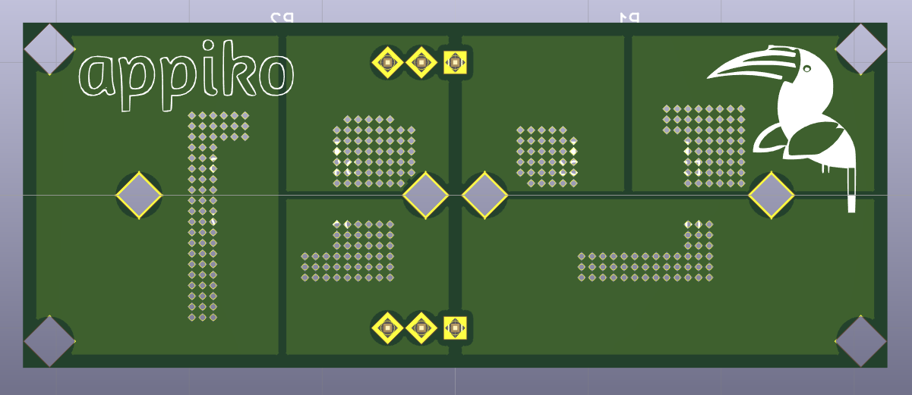

# SenseCam_SFH4715AS_rev1

This repo contains the Kicad PCB design of the first revision of SenseCam IR Flash board containing the SFH4715AS IR LEDs. This board is designed to be driven by SenseCam_STCS2A_rev1 LED driver board, and work with SenseCam_rev1 to make night photography in pitch dark possible.

