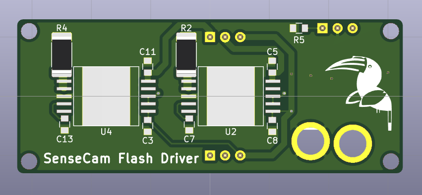
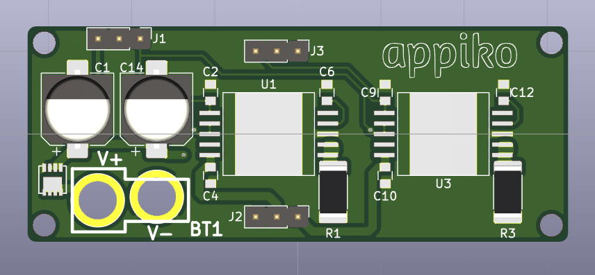

# SenseCam_STCS2A_rev1

This repo contains the Kicad PCB design of the first revision of SenseCam LED Flash driver board containing the STCS2A constant current LED driver IC. This board is designed to be driven by SenseCam_rev1 to provide enough current to drive the LEDs for a powerful flash.

