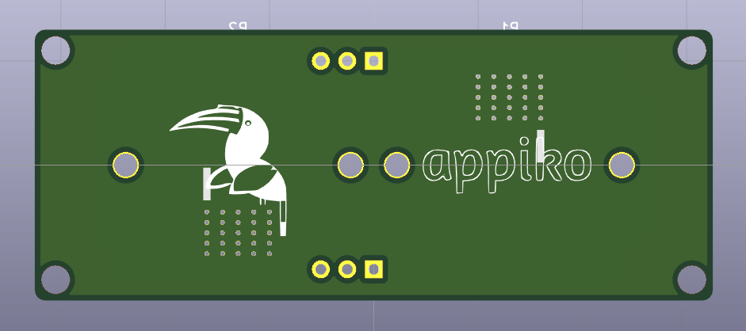
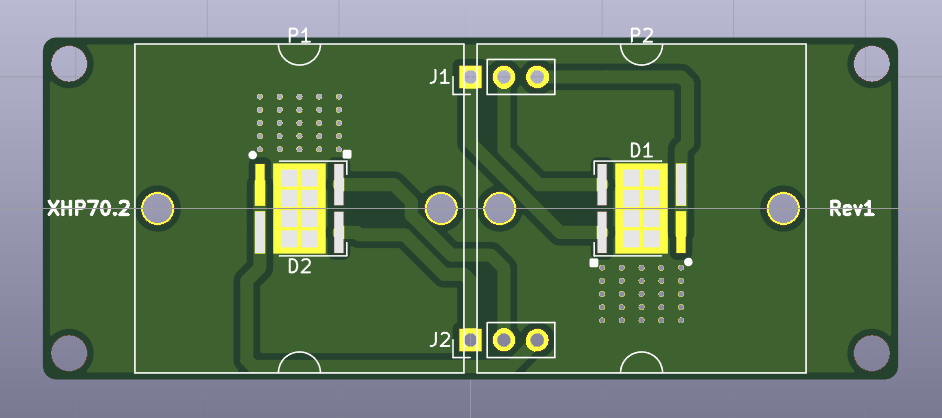

# SenseCam_XHP70.2_rev1

This repo contains the Kicad PCB design of the first revision of SenseCam LED Flash with XHP10.2 high power LEDs. This board is designed to be driven by SenseCam_STCS2A_rev1 LED driver board, and work with SenseCam_rev1 to make night photography in pitch dark possible.

