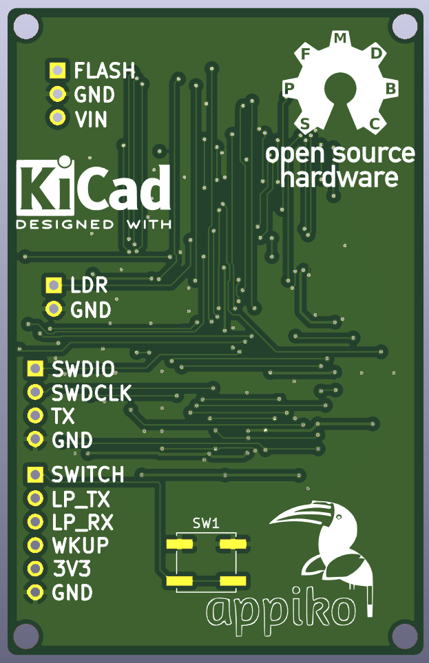
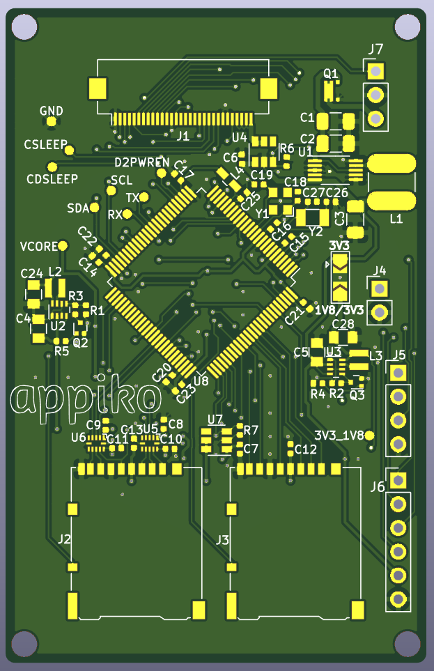

# SenseCam revision 1

This repo contains the Kicad PCB design of the first revision of SenseCam base board containing the STM32H750. This board is designed to interface an image sensor, interface two SD cards with both the SDMMC and multiple low power buck regulators to power the microcontroller.

